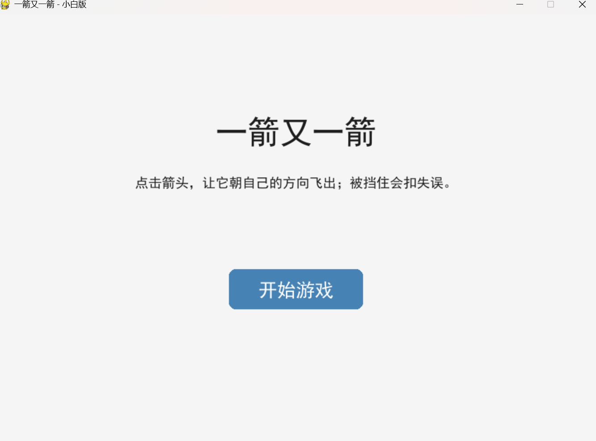
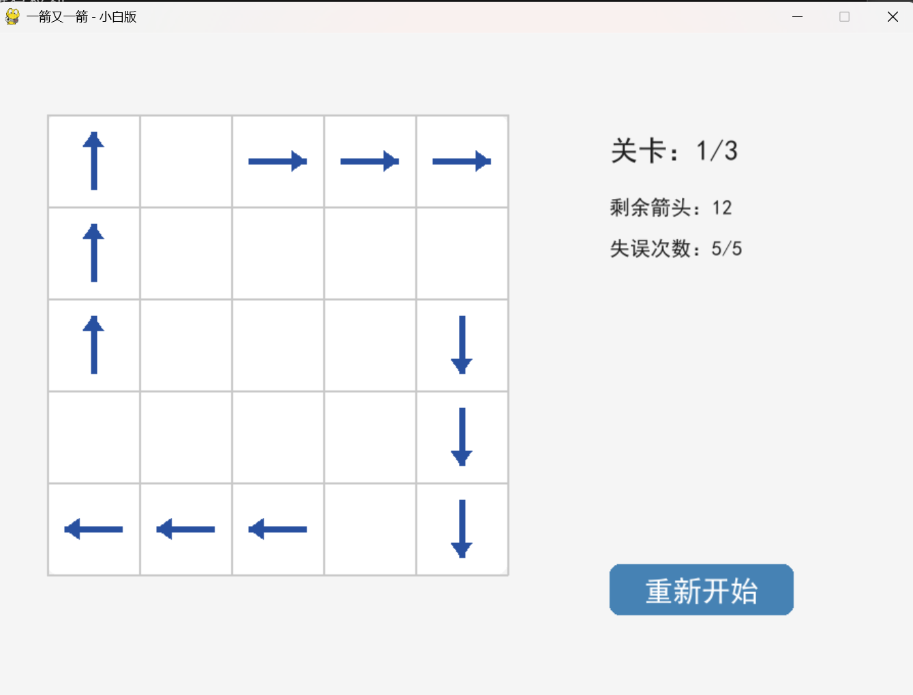

# 一箭又一箭

## 项目简介
一个使用 Python + Pygame 开发的点击式箭头解谜小游戏。玩家点击箭头，如果前方没有阻挡，箭头会飞出棋盘；否则会晃动并扣除失误次数。

## 开发环境
- Python 3.12.4
- Pygame 2.6.1

## 安装依赖
py -3.12 -m pip install pygame

## 运行方法
py -3.12 main.py

## 游戏操作说明
- 鼠标点击箭头
- 箭头前方无阻挡：箭头飞出棋盘并消失
- 箭头前方有阻挡：箭头晃动变红，失误次数减 1
- 点击“重新开始”按钮可以重置当前关卡
- 清空所有箭头即可进入下一关
- 失误次数为 0 时失败

## 游戏截图

